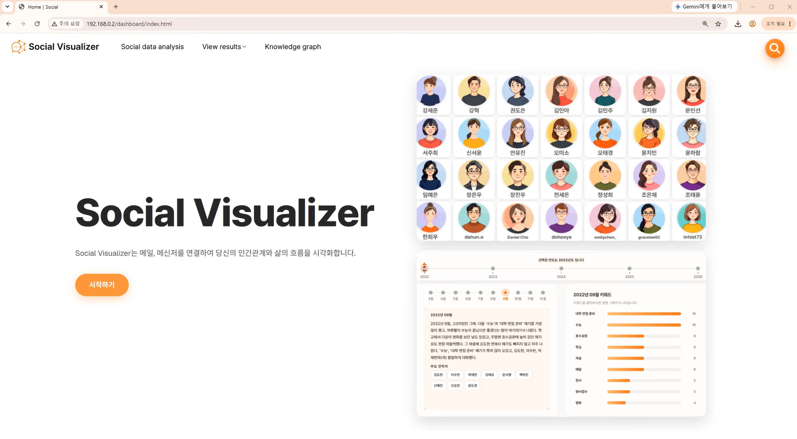
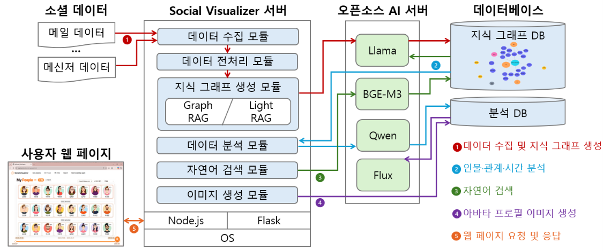
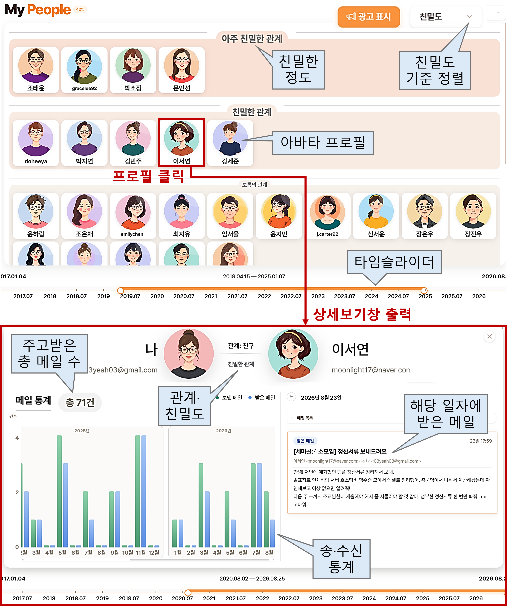
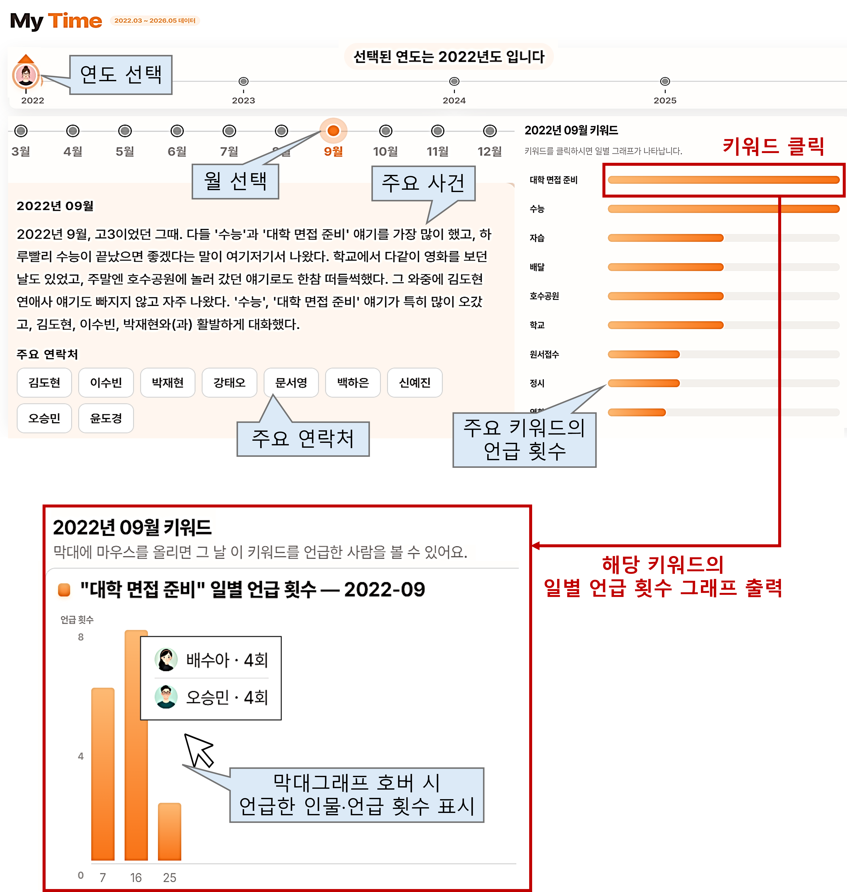
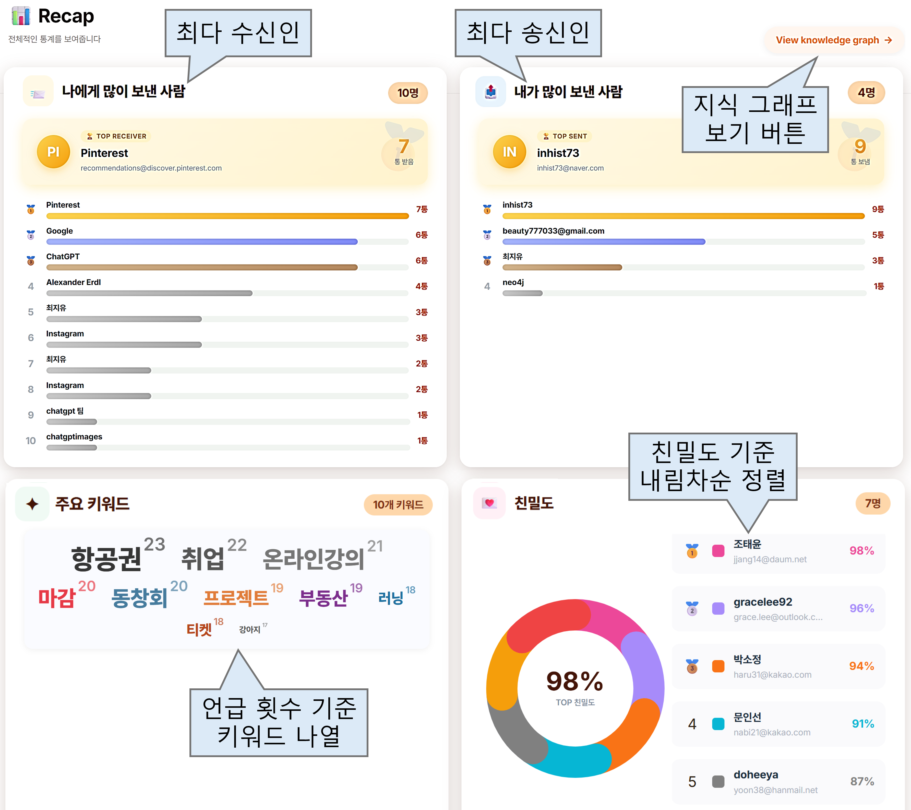
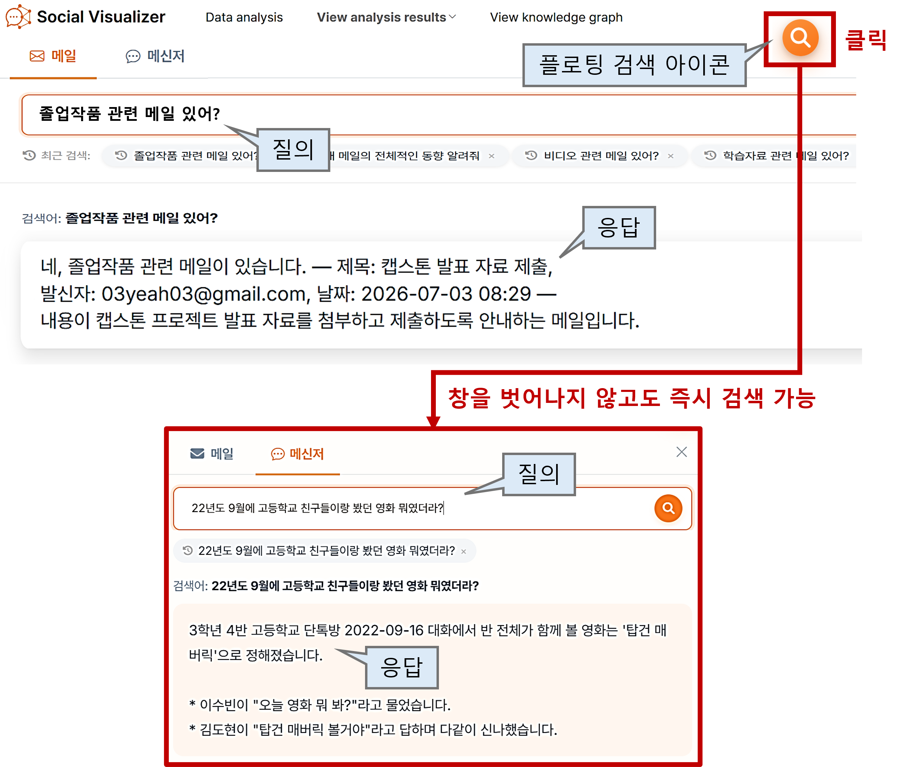

# _Social Visualizer_
> <u><b>소셜 데이터</b></u>를 <u><b>지식 그래프</b></u>로 구조화하여, <u><b>인물 관계와 시간의 흐름</b></u>을 <u><b>분석·시각화</b></u>하고 <u><b>자연어 검색</b></u>이 가능한 <u><b>오픈소스 플랫폼</b></u>

---

## 🎬 시연 영상

<a href="https://youtu.be/RDueDD39eTI?si=E3ReXJa3mdewYrBK">
    
    
👉 시연 영상 보러 가기

</a>

---

## 📚 가이드

<table>
  <tr><td>설치 · 실행</td><td><a href="docs/EXECUTE.md">EXECUTE</a></td></tr>
  <tr><td>라이선스</td><td><a href="LICENSE">LICENSE</a> · <a href="LICENSE_3rd.md">THIRD PARTY</a></td></tr>
  <tr><td>SW 자재명세서</td><td><a href="docs/SBOM.csv">SBOM</a></td></tr>
</table>

---

## 📋 목차

- [시스템 소개](#-시스템-소개)
- [시스템 구성 및 아키텍쳐](#-시스템-구성-및-아키텍쳐)
- [시스템 주요 기능](#-시스템-주요-기능)
- [기대효과 및 활용 분야](#-기대효과-및-활용-분야)
- [차별성 및 혁신성](#-차별성-및-혁신성)
- [기술 스택](#-기술-스택)

---

## 💡 시스템 소개
### 1. 개발 배경

사람들은 일상과 업무 속에서 <b>방대한 규모의 소셜 데이터(메일·메신저 등)를 축적</b>한다. 이러한 <b>소셜 데이터</b>에는 단순한 대화 내용뿐만 아니라 <b>사람 간 관계, 사건, 시간에 따른 변화 등 개인의 사회적 행적</b>을 보여주는 다양한 정보가 포함되어 있다. 이를 활용해 인간관계·사건 변화 등을 추적하거나 지능적으로 분석하고자 하는 수요가 존재한다. 

현재는 소셜 서비스에서의 <b>단순 검색</b> 또는 <b>대화형 LLM을 통한 질의나 분석</b>이 보편적이다. 이러한 방식의 문제점은 다음과 같다.

- 이러한 방식은 사용자가 요청한 검색이나 질의에 대해 <b>매우 단편적인 결과만 출력</b>
- 매번 데이터를 전달해야 하는 <b>불편함</b>
- <b>개인정보 유출</b> 우려와 <b>할루시네이션 가능성</b>
- <b>세밀한 시각화의 어려움</b>

따라서 본 팀은 <b>소셜 데이터</b>를 <b>문맥 분석이 가능한 구조</b>로 만들어, 사람 간의 관계, 사건, 시간에 따른 변화 등 <b>개인의 사회적 기록을 가시화</b>하는 도구가 필요하다고 판단한다.

---

### 2. 개발 목표

메일·메신저·회의록·통화 녹음 등 유형과 관계없이 <b>어떤 소셜 데이터</b>라도 <b>문맥 분석이 가능한 지식 그래프</b>로 구축하고, 개인이나 조직의 관심사, <b>인물·시간 관계</b> 등을 세밀하게 분석하여 <b>시각화</b>하는 오픈소스 플랫폼을 개발한다.

---

## 🧱 시스템 구성 및 아키텍쳐

 

 ◼ <u><b>Social Visualizer 서버</b></u>
- <b>데이터 수집 모듈</b>: IMAP 프로토콜로 메일 수집. 파일 업로드 방식으로 메신저 수집
- <b>데이터 전처리 모듈</b>: 정제·정렬·첨부파일 텍스트 추출 등 원문 소셜 데이터 전처리
- <b>지식 그래프 생성 모듈</b>: 인물·관계·사건 등의 엔티티·관계 추출. GraphRAG/LightRAG 중 선택 가능하도록 모듈화
- <b>데이터 분석 모듈</b>: 기간별 키워드·인물별 어조·소통 패턴 분석 및 친밀도 산출
- <b>자연어 검색 모듈</b>: 지식 그래프 기반 의미·맥락 검색 수행
- <b>이미지 생성 모듈</b>: 인물 정보(관계·어조·성별 등) 기반 이미지 생성 프롬프트 작성

---

 ◼ <u><b>오픈소스 AI 서버</b></u>: 기능별로 역할을 분담해 모델 구성

<b>AI 모델 상세</b>

| 구분 | 모델 | 용도 | 라이선스 |
|---|---|---|---|
| Llama — Index | [`meta-llama/Llama-3.1-8B-Instruct`](https://huggingface.co/meta-llama/Llama-3.1-8B-Instruct) + [Index LoRA Adapter](https://huggingface.co/Golden-Olive/llama-3.1-8b-socialvisualizer-index-lora) | GraphRAG 그래프 인덱싱 (`extract_graph`, `community_reports`) | Meta Llama License |
| Llama — Query | `meta-llama/Llama-3.1-8B-Instruct` + [Query LoRA Adapter](https://huggingface.co/Golden-Olive/llama-3.1-8b-socialvisualizer-query-lora) | GraphRAG 질의응답 (`local_search`, `global_search`) | Meta Llama License |
| Qwen | [`Qwen/Qwen2.5-7B-Instruct`](https://huggingface.co/Qwen/Qwen2.5-7B-Instruct) | 범용 서브태스크 수행 | Apache-2.0 |
| FLUX | [`black-forest-labs/FLUX.1-schnell`](https://huggingface.co/black-forest-labs/FLUX.1-schnell) | 이미지 및 아바타 생성 | Apache-2.0 |
| Embedding | [`BAAI/bge-m3`](https://huggingface.co/BAAI/bge-m3) | 텍스트 임베딩 및 벡터 검색 | MIT |

> Llama LoRA Adapter의 학습·서빙에 대한 자세한 내용은 [`llama-finetune/README.md`](./llama-finetune/README.md)를,
위 모델 서버들의 설치·실행 명령은 [`llama-finetune/serving/gpu_server_ops.md`](./llama-finetune/serving/gpu_server_ops.md)를 참고.

- <b>Llama</b>: 엔티티·관계 추출 및 자연어 질의응답
- <b>BGE-M3</b>: 자연어 질의 임베딩
- <b>Qwen</b>: 인물 특성 및 활동·주제·사건·키워드 분석
- <b>Flux</b>: 이미지 생성 모듈이 구성한 프롬프트로 인물별 아바타 프로필 이미지 생성

---

◼ <u><b>데이터베이스</b></u>
- <b>지식 그래프 DB</b>: 엔티티·관계·커뮤니티 등의 지식 그래프 생성 결과물 저장
- <b>분석 DB</b>: 지식 그래프에서 분석한 결과(인물·관계·시간·친밀도·키워드 등) 저장

---

## ✨ 시스템 주요 기능

◼ <b><u>My People: 인물 간 관계 분석</u></b>

- <b>소통 인물 분석</b>: 대화를 나눈 인물과 인물별 소통량·상호작용 정보 분석
- <b>관계·친밀도 분석</b>: 인물 간 관계와 친밀도를 분석하여 시각화
- <b>기간별 관계 분석</b>: 타임슬라이더로 기간을 설정하고 시점에 따른 관계·소통 변화 분석
- <b>아바타 프로필 생성</b>: 인물별 주요 특성 기반으로 프로필 이미지 생성
- <b>인물 상세 정보</b>: 소통량·관계·주요 주제·키워드 등 인물별 상세 분석 결과 확인

---

◼ <b><u>My Time: 시간 기반 분석</u></b>

- <b>주요 사건 하이라이트</b>: 월/연별 주요 사건을 추출하여 핵심 활동과 변화 요약
- <b>기간별 사건 분석</b>: 타임슬라이더로 설정한 기간의 주된 활동·주제·키워드·주요 연락처·일별 키워드 언급 횟수 등 시각화

---

◼ <b><u>Recap: 소셜 데이터를 분석한 통계치 가시화</u></b>

- <b>통합 가시화</b>: 전체 소셜 데이터를 요약한 통계들을 한 페이지로 시각화
- <b>최다 소통 인물</b>: 나와 최다 송·수신한 사람들을 소통량 기준으로 정렬
- <b>주요 키워드</b>: 반복적으로 등장한 핵심 키워드 가시화
- <b>친밀도</b>: 전체 인물에 대한 친밀도 분석 및 시각화

---

◼ <b><u>자연어 검색</u></b>

- <b>문맥 기반 탐색</b>: 키워드에 한정되지 않고 자연어 질의를 통한 소셜 데이터 탐색
- <b>플로팅 검색</b>: 상단의 플로팅 아이콘을 통해 화면 이동 없이 어디에서든 질의 가능

---

## 🚀 기대효과 및 활용 분야

- <b>방대한 소셜 데이터</b>에 담긴 과거/현재의 <b>인간관계·시간의 흐름·활동 파악</b>용으로 활용
- 개인이나 조직에서 사건·범죄 등의 <b>특수한 이벤트 추적용</b>으로 활용
- 개인이나 조직에서 <b>사건의 흐름을 시간·인물별로 파악</b>하는 도구로 수정 및 확장 가능
- 개인의 모든 소셜 데이터를 한 곳에 모으는 <b>디지털 아카이브 용도</b>로 활용

---

## 💎 차별성 및 혁신성

Social Visualizer는 기존 소셜 서비스의 검색 기능이나 대화형 LLM으로는 다루기 어려웠던, <b>대량의 소셜 데이터</b>에 축적된 <b>사회활동 기록의 맥락을 분석</b>한다는 점에서 큰 의의를 가진다. 주요 차별성과 혁신성은 다음과 같다.  

◼ <b><u>방대한 소셜 데이터의 맥락 파악에 용이한 방법 제시/구축/실용성 증명</u></b> 
&nbsp;&nbsp;<b>대규모의 소셜 데이터</b>를 관계·시간 중심으로 재구성하여, 정보 간 연결 관계를 따라 <b>맥락을 파악</b>하는 방법을 제시하였다. 이는 하나의 문서나 특정 키워드에 대한 답을 찾는 것을 넘어, <b>관련된 인물·관계·사건·시간 정보를 연결한</b>다. Gmail·Naver·iCloud의 메일과 3MB~8GB 규모의 카카오톡 데이터로 검증하고, 실사용 가능한 수준임을 증명하였다.  

◼ <b><u>높은 직관성과 다양성을 가진 관계·시간의 시각화</u></b> 
&nbsp;&nbsp;<b>복잡한 관계가 얽힌 소셜 데이터</b>를 그래프·타임슬라이더 등 다양한 시각적 요소로 표현하여 한눈에 파악할 수 있도록 한다. 텍스트로 풀어 설명하는 기존의 LLM과 달리, Social Visualizer는 주요 관계 및 변화의 흐름을 <b>직관적으로 이해</b>하게 한다.  

◼ <b><u>자연어 검색 정확도 93%를 달성하여 우수한 검색 성능 입증</u></b> 
&nbsp;&nbsp;평균 검색 정확도 93%, 평균 응답 시간 5.4초를 달성하였다. 이는 지식 그래프 기반 맥락 탐색이 <b>대규모 소셜 데이터에서 높은 검색 성능</b>을 보임을 의미한다.  

◼ <b><u>자체 Llama 파인튜닝으로 상용 API 수준의 지식 그래프 생성·질의응답 성능 달성</u></b> 
&nbsp;&nbsp;오픈웨이트 Llama를 고도로 파인튜닝하여, <b>상용 API 없이도</b> 지식 그래프 생성 및 자연어 질의응답을 수행한다. <b>과금 없이 상용 수준의 성능</b>을 달성하였으며, 외부 서버로 데이터를 보낼 필요가 없어 <b>개인정보 유출 우려를 근본적으로 차단</b>하였다.  

◼ <b><u>서로 다른 형식의 소셜 데이터를 공통 체계로 구조화하는 방법 제시/구현</u></b> 
&nbsp;&nbsp;메일·메신저 등 <b>서로 다른 형식과 구조</b>를 가진 소셜 데이터를 <b>공통 체계로 구조화</b>한다.  회의록·통화 녹음 등 새로운 유형의 소셜 데이터를 추가하여도, 해당 유형에 맞는 처리 모듈만 구현하면 된다. 이러한 방식은 <b>분석·검색의 대상을 손쉽게 확장</b>할 수 있게 한다.  

◼ <b><u>높은 확장성과 이식성을 갖춘 오픈소스 소프트웨어 구조</u></b> 
&nbsp;&nbsp;지식 그래프 모듈화를 통해 목적·용도에 맞게 지식 그래프 생성 모듈을 쉽게 <b>교체·확장</b>할 수 있다. 앞서 언급한 바와 같이 소셜 데이터 유형의 확장도 용이하다. 이러한 모듈화된 구조를 기반으로, 본 시스템은 <b>누구나 자유롭게 수정·확장·이식·재구성</b>할 수 있는 유연한 오픈소스 소프트웨어 구조를 갖는다.

---

## 🧰 기술 스택

### 개발 환경

### 개발 언어
    

### 개발 도구 및 라이브러리
           

---

## 📒 참고 자료
- Microsoft GraphRAG: https://github.com/microsoft/graphrag
- HKUDS LightRAG: https://github.com/HKUDS/LightRAG
- Meta Llama: https://github.com/meta-llama/llama3
- Qwen: https://github.com/QwenLM
- BAAI FlagEmbedding (BGE-M3): https://github.com/FlagOpen/FlagEmbedding
- Black Forest Labs FLUX: https://github.com/black-forest-labs/flux

---

## 🤝 참여자

